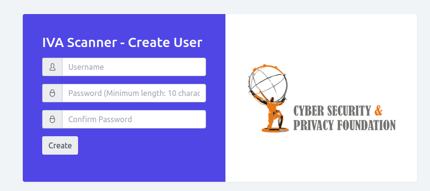
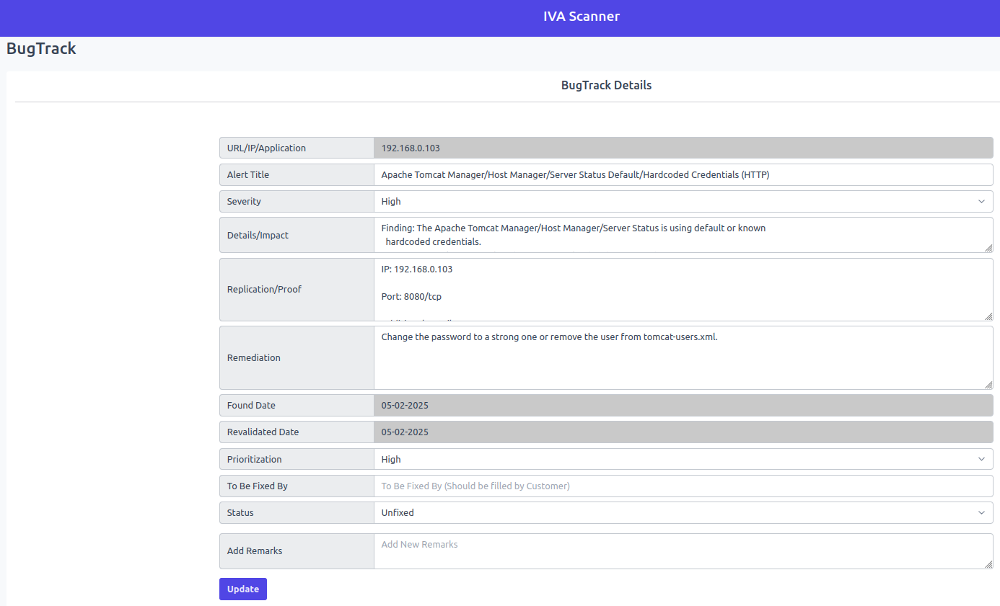

# IVA Scanner Manual

## Accessing the Panel

On your desktop, open a browser (Firefox or Chrome, recommended: Firefox) and enter the following address.
https://localhost:8443

- You will get a self-signed certificate error message.  Click the `Advanced` button and then click the `Accept the Risk and Continue` button.


- Then, the panel with show the user account creation page. Fill out the form with username, password and confirm password.

Note: The email address is just for user creation. It is not used or uploaded to any external server.


 
- Once created you will get a login page, you can provide the username and password to log in. Once logged in, you can see the IVA Scanner home page.


## How to scan the target?

### Pre-requisites

Before you begin, make sure you have the target URL/IP/IP Range and ensure it is accessible from the virtual machine IP.

### Steps

### 1. Login

- Open a web browser and navigate to the IVA Scanner Panel.
- Enter your login credentials to access your account.

### 2. Go to the Add Scan page

- From the side menu, locate and click on the `Add Scan` option. This will take you to the `Add Scan` page.
- Enter the target URL/IP/IP range.


### 3. Add the target

- Click on `Add` to submit the target URL/IP. Once added successfully, it will display the `success` message.


## View Scans

- In this menu, you can view the scan reports and alerts, and also you can delete the scan.


Each row represents a specific target and includes the following information:

**Target**

- Displays the added scan URL or IP or IP range.    

**Status**

Displays the status of the scan.
    
- **Yet to start:** Denotes that the scan has not started yet.

- **Scan started:** Denotes that the scan has started.

- **Report generated:** Denotes that the scan has been completed and the report generated.

- **Scan Failed:** Denotes that the scan failed due to an error.

- **Unreachable:** Denotes when the URL is not reachable.

### Action

&nbsp; During the scan, the IVA Scanner identifies vulnerabilities in the target.
    
&nbsp;&nbsp;&nbsp;&nbsp; Under this menu, there are three options: Report, Alerts, and Delete.
    

***Report:***

After the scan is complete, click on the `Report` button to download the report.


The generated report includes the following details
- Overall CVSS score, Severity level.
- Executive summary which gives a summary of the scan results. Also, it provides key points to mitigate the vulnerability, overall risk assessment, and recommendations.
- CVE, CVSS metrics
- Remediations and References.

***Alerts:***
    
Click on the `Alerts` option to display in the panel itself the vulnerability details generated by the IVA Scanner. In the Alerts window, you will see a detailed presentation of the CVSS score chart, scan details, and the count of vulnerabilities.

The vulnerabilities are listed according to their severity level which can be critical, high, medium, low, and info.


> Note: Click the alert title to view the details.


You can add the vulnerabilities to BugTrack by clicking on the `Add to BugTrack` option. Through BugTrack, you can track the vulnerability, and prioritize and fix the vulnerabilities.

Edit entries like severity, impact, remediations, remarks, and all, and then Click on `Add` to add the vulnerability to BugTrack.


Once added, it will display a `success` message.

***Delete:***

To delete the scan, you can click on `Delete` and click on `OK` in the banner to confirm the deletion.


Once deleted, it will display a `success` message.


## Differential Scan

A differential scan looks for vulnerabilities on websites or IP addresses and ranks them from high to low severity. It compares the current scan with previous ones to find new issues and track progress. After fixing a vulnerability, you can rescan to see which problems have been fixed and which are still there.

There are two sections: One is `Add Scan` and the other is `List scans`.

***Add Scan***

To run the differential scan, you can add the URL or IP/IP range.


***List Scans***
	
The List Scans section provides an overview of all previously conducted scans. You can view the scan reports, alerts and also you delete the scan.


### Action

During the differential scan, the IVA scanner identifies vulnerabilities within the target.
	
Under this menu, there are three options: Report, Alerts and Delete.

***Report:***

After the scan is complete, click the `Report` button to download the report in Excel format.


***Alerts:***
	
- Click the `Alerts` option to display the vulnerabilities directly in the panel.
- In the Alerts window, you will see a detailed presentation of the CVSS score chart, scan details, and the count of vulnerabilities.
- The vulnerabilities are listed according to their severity level which can be critical, 	high, medium, low, and info.


1. **Rescan:**

Once you've addressed vulnerabilities or wish to see updated results, you can use the rescan option to re-scan the website or IP address/range. This will show any 	remaining or new vulnerabilities and reflect changes after fixes. You can run as many rescans as needed.

2. **Mark this as Main**
	
After a rescan, the option "Mark this as Main" appears. Clicking this will set the 	rescan results as the primary scan results. This step will enable the "Rescan" option for future rescans. Once you select "Mark this as Main," the fixed alerts will be removed from the alerts panel. 


3. **Export Alerts:**

To generate an external record of the scan results, you can click on `Export Alerts`. This will export all the alert data into an Excel sheet for further analysis.


> Note: Click the alert title to view the details.

4. **Unfixed Alerts**

Under Unfixed alerts, it displays all vulnerabilities detected during the scan, organized 	by severity.

Here, you can:

- Review each alert and its associated risk level.
- Mark vulnerabilities as ignored, or false positives.
- Add specific vulnerabilities to the bug tracker for monitoring.

After a rescan, unfixed alerts show vulnerabilities that remain unresolved and appear in both the previous and current scans. These alerts indicate issues that still need to be addressed.


5. **Mark FP (False Positive)**

During the scan, if you identify a vulnerability as a false positive, you can click on `Mark FP` to classify it accordingly. This ensures that false alerts do not interfere with the actual security assessments.

6. **Mark Ignore**

If a vulnerability is determined to be insignificant or safe to ignore, you can mark it by clicking `Mark Ignore`. This helps organize the vulnerabilities, separating the ones that don’t require action from those that do.

7. **Add to BugTrack**
	
The BugTrack feature allows you to keep track of vulnerabilities and monitor the steps required to fix them. By adding vulnerabilities to BugTrack, you can ensure they are addressed systematically and actions are taken as needed.
	


8. **Fixed Alerts**

Fixed alerts are vulnerabilities that were detected in the previous scan but no longer appear in the rescan. This indicates that the issue has been successfully resolved.


9. **Ignored Alerts**

Vulnerabilities that you previously marked as ignored will appear in the ignored alerts section after rescanning. These represent issues that were deliberately overlooked due to their lower priority or insignificance.


10. **False Positive**

The false positives section lists vulnerabilities that were previously marked as false positives during the initial scan or rescans. These alerts were identified as non-issues or incorrect detections.


***Delete:***

 To delete the scan from differential scan lists, you can click on `Delete` and click on `OK` in the banner to confirm the deletion. Once deleted, it will display `success` message.


## BugTrack

In this menu, you can view and track the vulnerabilities list that was added previously.

You can export the BugTrack in an Excel sheet by clicking on `Export Bugs` on the top left.


    

### Action:

To update or view details of the BugTrack, click on the `Details` option. Modify the entries as needed and click on `Update` to save the changes.



To delete the BugTrack entry, click on the `Delete` option.


Once deleted, it will display a `success` message.

## Profile
    
You can view your profile information which includes name, username, and email address.


## Logout

You can click on the `logout` option to successfully logout from the panel.

## Forgot Password

- In case of a forgotten password you will need to destroy and rebuild the VM per the below step. And then go through the setup again.

 ```bash
 vagrant destroy iva-oss
 ```